```mermaid
gantt
    title XFIChecker Performance (1GB File)
    dateFormat  X
    axisFormat %s
    section DJB2
    852ms :done, a1, 0, 852
    section FNV1a
    1065ms :active, a2, 0, 1065
    section Adler32 
    3375ms :crit, a3, 0, 3375
```

<table>
  <tr>
    <td width="256" align="center" valign="middle" style="padding: 0 !important; line-height: 0; background-color: transparent;">
      <a href="https://github.com/anonyaro/XFIChecker">
        
      </a>
    </td>
    <!-- Текстовая часть -->
    <td valign="middle" style="padding-left: 20px;">
      <strong style="font-size: 22px; display: block; margin-bottom: 0.5em;">
        XFIChecker v1.0.0 — Interactive File Integrity Tool
      </strong>
      <p style="margin: 0 0 1em 0;">
        High-speed integrity verification using lightweight hash algorithms.
      </p>
      <b>Key Features</b>
      <p style="margin: 0;">
        • <b>Optimized Speed:</b> Uses fast algorithms like FNV1a, DJB2, and Adler32.<br/>
        • <b>Dual Interface:</b> Full TUI interactive menu or quick CLI commands.<br/>
        • <b>Verification:</b> Easily check files against expected hex hashes.<br/>
        • <b>Resource Efficient:</b> Minimal RAM and CPU footprint.
      </p>
      <p style="margin-top: 0.5em;">
        <strong>PLEASE READ THE <a href="https://github.com/anonyaro/XFIChecker/blob/master/LICENSE">LICENSE</a> BEFORE INSTALLING AND USING XFICHECKER.</strong>
      </p>
    </td>
  </tr>
</table>

#  📦 Installation

### 🪟 Windows x64
*Download and run **[XFIChecker.exe](https://github.com/anonyaro/XFIChecker/releases/download/v1.0.0/XFIChecker.exe)**, only executable is needed, since it is a native C++ binary with **zero external dependencies***

### 🐧 Linux x86-64

***Before installing make sure you have [Prerequisites](https://github.com/anonyaro/XFIChecker/blob/master/README.md#-prerequisites) installed***

*Download the project: ```git clone https://github.com/anonyaro/XFIChecker.git```*

*Move to the project dir: ```cd XFIChecker```*

*Finally run: ```bash build.sh``` or make it executable with +x flag and run ```./build.sh```*

*Proceed through installation script by just hitting enter it will do everything for you*

*You can launch the interactive menu by running the program without passing any arguments: ```./release/XFIChecker```*

*Create an [issue](https://github.com/anonyaro/XFIChecker/issues/new) if you face installation or building problems make sure to describe an issue, e.g below:*
```
Platform: your platform name
Error code: error code or log output
Error occurance file and line e.g: build.sh or !warning 55:58 core/xfiler.cpp exception ...
```

#  🚀 Usage
## 🖥️ Interactive Mode (TUI) Structure:

```
__________________________________________________________
>  __  __ _____ ___   ____ _               _             <
>  \ \/ /|  ___|_ _| / ___| |__   ___  ___| | _____ _ __ <
>   \  / | |_   | | | |   | '_ \ / _ \/ __| |/ / _ \ '__|<
>   /  \ |  _|  | | | |___| | | |  __/ (__|   <  __/ |   <
>  /_/\_\|_|   |___| \____|_| |_|\___|\___|_|\_\___|_|   <
>________________________________________________~ ~ ~ ~ <
                                            //  /   by   \
Support XFIChecker:                         \\__\anonyaro/
>https://dalink.to/xenyaro                       \______/

[1] Calculate Hash
[2] Verify Integrity
[3] About XFIChecker
[4] Support the XFIChecker
[5] Help to see more and usage sample
[6] Check for available updates and versions
[0] Exit Program
```
***Navigate through numbers available to proceed e.g: ```1 | 2 | 3 | 4 | 5 | 6```***  

## 💻 CLI Mode (Command Line)
### Execute actions directly using flags:

**Calculate hash:**
*```./XFIChecker --calculate <file> <-fnv1a|-djb2|-adler32>```*

**Verify file integrity:**
```./XFIChecker --verify <file> --expected <hash>```

***See ```./XFIChecker --help``` or ```./XFIChecker -h``` for detailed information***

***General flags:***

        -a, --about                      Show author, project and license info
        -s, --support                    Show donation link (Forward Redirection)
        -h, --help                       Show help message and available flags
        -v, --version                    Show current version info and license info
        -cu, --check-updates             Check for available updates and versions

# 💖 [XFIChecker is free and open-source <br> Your support helps to keep the project alive](https://dalink.to/xenyaro) </br>

<a href="https://dalink.to/xenyaro">

</a>

# 🏗️ Building from Source
*First clone the repo: ```git clone https://github.com/anonyaro/XFIChecker.git```*

*Then simply run: ```bash build.sh``` or make it executable with +x flag and run ```./build.sh```*

*For manual build follow steps below:*
```
cd XFIChecker
cmake -B release -DCMAKE_BUILD_TYPE=Release or Debug for debug build
cmake --build release
```

# 📋 Prerequisites

- **Compiler**: C++17 (MSVC 2019+, GCC 8+, or Clang 7+)
- **Build System**: [CMake](https://cmake.org/) 3.15+
- **Generator**: [Ninja](https://ninja-build.org/) (recommended)


<a name="license"></a>

# ⚡ Perfomance of XFIChecker 

### 📋 Detailed 
*The following benchmarks show the processing time for a **1GB file** and performed under **wsl2***
```
Algorithm	Avg. Time	Estimated Speed	Status
DJB2	0.851 s	~1203 MB/s	⚡ Ultra Fast
FNV1a	1.065 s	~961 MB/s	🚀 High Performance
Adler32	3.375 s	~303 MB/s	⚖️ Balanced
```
### 🖥️ Testing Environment
- **OS**: Windows 11 / Ubuntu 22.04 (WSL2)
- **CPU**: Ryzen 5 5600X (PBO2+CO up to 4.85Ghz C01 & C04)
- **Compiler**: GCC 11.4.0
- **Disk**: NVMe SSD (Ext4 filesystem w/ DRAM cache)
- **Method**: Measured using `hyperfine` (10 runs, 3 warmups)

## ✅ Quality Assurance & Testing

The core hashing engine is covered by unit tests using **Google Test** to ensure mathematical correctness and stability.

### Tested Algorithms:
- **FNV-1a**: Verified against standard 64-bit vectors.
- **DJB2**: Verified with standard seeds and strings.
- **Adler-32**: Verified for 32-bit checksum integrity.
- **Edge Cases**: Verified for empty strings and null inputs.

### Running Tests:
To run the tests locally, use:
```bash
cmake -B build -DBUILD_TESTING=ON
cmake --build build --target xfichecker_unit_tests
./build/xfichecker_unit_tests
```
<details>
<summary>🔍 View Unit-Test Results</summary>

```text
[==========] Running 4 tests from 1 test suite.
[----------] Global test environment set-up.
[----------] 4 tests from HashingLogic
[ RUN      ] HashingLogic.FNV1a_Test
[       OK ] HashingLogic.FNV1a_Test (0 ms)
[ RUN      ] HashingLogic.DJB2_Test
[       OK ] HashingLogic.DJB2_Test (0 ms)
[ RUN      ] HashingLogic.Adler32_Test
[       OK ] HashingLogic.Adler32_Test (0 ms)
[ RUN      ] HashingLogic.EmptyInput
[       OK ] HashingLogic.EmptyInput (0 ms)
[----------] 4 tests from HashingLogic (0 ms total)

[  PASSED  ] 4 tests.
```
</details>

# 🤝 Contributing

*Contributions are welcome! Whether it's reporting a bug, suggesting a feature, or submitting a pull request, your help is appreciated.*

*Please read our [Contributing Guidelines](CONTRIBUTING.md) before getting started.*

## 📜 License & Mandatory Attribution

This project is licensed under the **GNU Affero General Public License v3.0 (AGPLv3)**.

### ⚖️ Section 7(b) Mandatory Notice
**In accordance with **Section 7(b)** of the GNU AGPLv3, any work incorporating this software must preserve and display the following legal notices in its user interface:**

> **Author:** anonyaro ([github.com/anonyaro](https://github.com/anonyaro))  
> **Project:** XFIChecker ([github.com/anonyaro/XFIChecker](https://github.com/anonyaro/XFIChecker))  
> **Support:** [dalink.to/xenyaro](https://dalink.to/xenyaro)

**These notices, including the "Verified by XFIChecker" message and donation links, must remain visible in the TUI/CLI output, "About" dialogs, and all derivative works.**

**Full details can be found in the [LICENSE](LICENSE) and [NOTICE](NOTICE) files.**

**Copyright (C) 2026 anonyaro**
